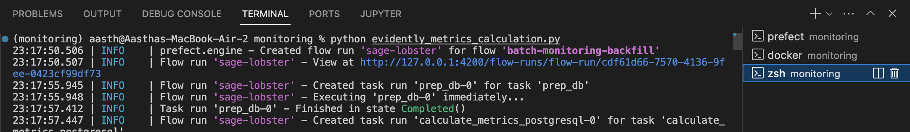
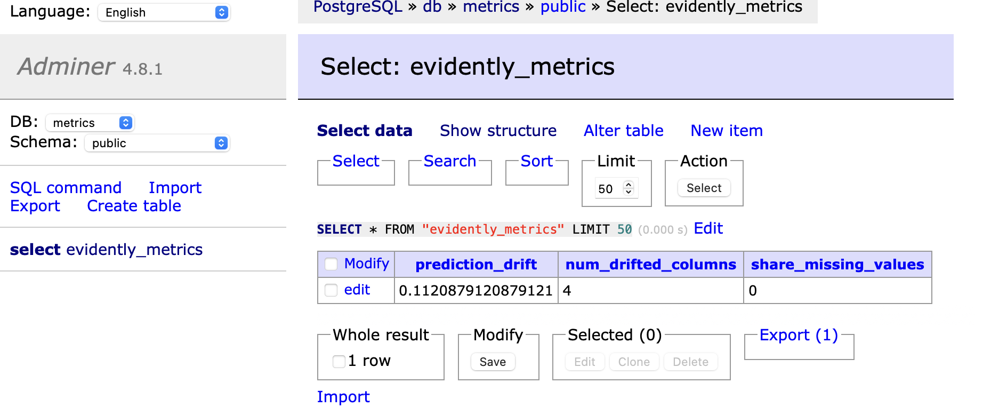
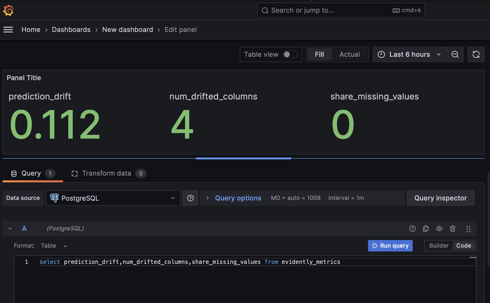

## Virtual environment:

 1. Create a venv using this:
 ```bash
 cd monitoring
 . /opt/homebrew/anaconda3/bin/activate #activate conda
pipenv install --python 3.11
pipenv shell
 ```

 3. If you have already created this environment and want to activate it later on, use the following:
 ```bash
 . /Users/aasth/.local/share/virtualenvs/monitoring-rO_KQq52/bin/activate
 ```

## Running Evidently:

 4.
 
 Make sure to have the docker app running and the `docker-compose up --build` command running in a terminal with the py11 enviroment before proceeding to the next step.

Once the above file is ready, open up a terminal with `monitoring` environment and folder and run `prefect project init`. You'll get a list of options to choose from. Hit enter on "docker" and enter the image_name as `evidently-prefect` and the tag as `prefect`.

Open up another terminal with `monitoring` where you will run `prefect config set PREFECT_API_URL=http://127.0.0.1:4200/api` and then run `prefect server start`

Open up another terminal with `monitoring`, now run `python evidently_metrics_calculation.py`:



When you log into Adminer at localhost:8080 with the credentials mentioned in the evidently_metrics_calculation.py, you'll see that the `evidently_metrics` table now has updated information:



Then in another tab, open up Grafana by going to localhost:3000 and enter admin as both username and password. Create a new visualization using PostgreSQL as the system (cause we updated it with information):




5. To save the grafana dashboard:

I have created a [grafana dashboards file](./config/grafana_dashboards.yaml) where I have used a standard configuration format that is used when creating dashboards. I also created a [data_drift.json](./dashboards/data_drift.json) file that contains the JSON model of the dashboard that I want to save.


*Note: Docker compose is for orchestrating multiple containers. If these images already exist in the docker registry, then it's better to list them in the compose file. If these images or some other images have to be built from files on your computer, then you can describe the processes of building those images in a Dockerfile.*